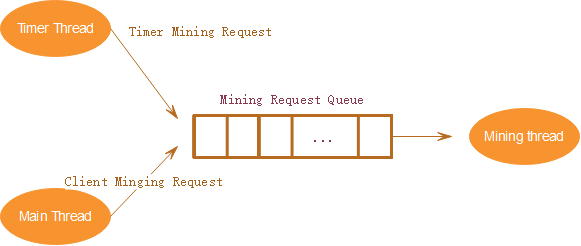
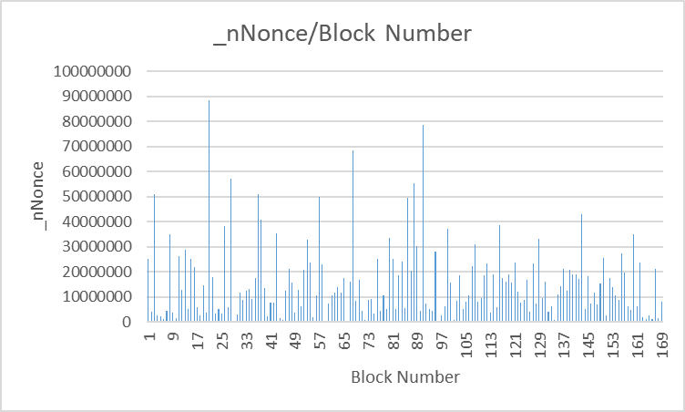

# Clock Chain

## 1. Introduction 

The main idea in a BlockChain is that the provenance of a piece of information becomes increasingly difficult to forge over time.  That is, every time data (a "block") is added to the chain, that data reinforces the fact that the data that precedes it in the chain is, indeed, present and immutable.

 In this project, we will make "clockchain".  The idea behind "clockchain" is that a server (the "clockchain server") will periodically insert timestamps into the chain.  A user can also request to add blocks of data to the chain.  If we trust that the timestamps are, indeed, inserted at the time they claim to have been inserted, then we can look at a block of data, and the next clock, and conclude that the block of data had to have been inserted before the clock's time.

 Clockchain could be a useful idea for an inventor: she could use it to prove that she had an idea before someone else, by showing that her idea is in the

clockchain before someone else's idea.  In that case, one might only insert a hash of the idea into the clockchain (because the idea might need to be kept

secret), but that's fine... the inventor could still prove that she had the idea by presenting the idea and showing that it generates the hash value that is in the chain.

There are several steps to this project.

1- you should read this reference:

https://davenash.com/2017/10/build-a-blockchain-with-c/.  Then you should implement it.

 

2- You should extend your implementation so that it is possible to display blocks from the blockchain.

 

3- You should transform the program so that it is an always-running server, and so that it can receive connections on a port (specified by the -p command-line option), read data over those connections, and then put that data into the chain.  Note that you will need to design a reasonable

protocol for how to send data, so that it includes the sender ID, the content, etc.

4- You should ensure that every block gets correctly persisted to a file, so that the program can be stopped and started without losing data. You will need an intelligent file format for this, since blocks have variable length.

 

You should add a timer to your server, so that a new block is added every minute.  This will provide the proof of "before" for entries

### Code Structure

├── Blockchain.cpp  # implementation of persistent, mining thread, timer thread

├── Blockchain.h

├── Block.cpp

├── Block.h

├── build/      # folder for building running programs

├── CMakeLists.txt

├── json/      #head files from https://github.com/open-source-parsers/jsoncpp

├── LICENSE

├── Mingclent.cpp  #implementation of the client for sending mining request

├── Queryclient.cpp #implementation of the client for displaying the block chain data

├── README.md

├── ChainServer.cpp   #clock chain server implementation

├── sha256.cpp

├── sha256.h

├── SHA256-LICENSE.txt

All the programs are in build directory. To build the program from scratch, in the build directory, run following commands in linux: 

**cmake -DCMAKE_BUILD_TYPE=Release ..**  

**make**

**clockchain**:  the clock chain server 

**miningclient**: the block chain client that communicates with server mining task

**queryclient**：the client to query the block chain data from the clock chain server 

All the codes are available in sunlab /home/yuha20/project3 as well.

## 2. Design

### 2.1 **Clock Chain Server**

We extend the codes based on  the original tutorial block chain in https://davenash.com/2017/10/build-a-blockchain-with-c/.  In the block chain server, it will create a BlockChain object and then it listens the connection from the client. When there is a request from the client, it will process the request according to the protocol in JSON into a mining request, and put into the queue of minging request. 

While in the clock chain server, two threads will be created as the BlockChain is constructed. One thread is the timer thread. It emits a timer mining request every minute into the mining request queue where the mining request from the client is stored as well. The another thread is the mining thread. It reads a request from the queue of mining requests, and does the actual mining work in AddBlock method of BlockChain object. 

Figure 1 Data flow in clock chain server

When there are multiple mining requests in the queue, it will accumulate  the requests in one minging task as far as the accumulated content length is less than 1000 bytes  to maximize the revenue from mining. 

The block chain data can be persisted into a JSON file named ../json/blockchain.json and recovered from the file. When a new block is mined, it will trigger the save method. When the server is started, it will load the block chain data from in the persistent file. The validity of the persistent file is done in the method of IsValidate in BlockChain object. Any modification of the file will be found since both the hash of the block content and the equality of chain of hashes are checked in this method.

The jsoncpp (https://github.com/open-source-parsers/jsoncpp) is used in this project.

The protocol between the client and clock chain server is JSON format. The flowing is an example. 

 {

​	"clientid" : 1, 

​	"content" : "\u0007\r\n\u0001E\u001d\u0000E\u0002R\u0011\u0011\u0000\u0011",

​	"op" : "mining",

​	"time" : 1607095340,

​	"token" : "xxxxxxxxxxxxxxxxxxxxxxx"

}

“clientid”: the unique identification for client

"content":the content to be mined from client. It was encrypted in client and can be decrypted in client for security and privacy reason.

"op" : the operation mode for the request. "mining" marks a mining request. “inquiry” marks a  block chain query request.

“time”: the time stamp from client.

“token”: the token used for authorization in server.

### 2.3 Mining Client

The mining client send the mining request to the clock chain server in the protocol defined above.

It uses XOR to encode the content in the mining request.

### 2.3 Query Client

It sends the query request to server to get the data of block chain and show the response

## 3. Test scenarios **and Results**

| **Test Area**            | **Test method**                                              | **Test Result**                                              |
| ------------------------ | ------------------------------------------------------------ | ------------------------------------------------------------ |
| Time Block               | Run the server, and see if there is a new time block  generated every minute | Time bock is generated and processed correctly               |
| Ming Request             | The client sends the mining request, and check whether the server can receive the request and process correctly | Ming request is received and processed correctly             |
| Persistent/save          | when a new block is generated, check whether it is added the persistent file | new block is added to the file ../json/blockchain.json       |
| Persistent/load          | kill the server, and restart the server, and to see if all the blocks are loaded correctly. | all the blocks in chain are loaded correctly                 |
| Validity                 | change the content of a block but not change the hash in persistent file, restart the server. | the server find that the content is changed and report an error |
| Validity                 | change the content and calculate the correct hash for the content | the server find that the content is changed by checking the chain of hashes and report an error |
| Display the block chains | use query client send the query request to the server, the server will response with a JSON string of block chains | block chains is displayed in the client                      |
| Performance              | sends 10 requests in 1 minute to simulate  requests from many clients simultaneously | the server can receive all the requests and put it into request queue. |
| Performance              | make the timer interval short to generate more time block request to see if the server can process correctly | The requests in the queue can be combined together as far as the accumulated content length is shorter than 1000 bytes |

Here are the files for the TestChain C++ tutorial I have placed on my website http://davenash.com/2017/10/build-a-blockchain-with-c/

## 4.Mining Performance Analysis

According to the project requirement, only one miner is in the server. The miner read a mining request from front of the mining request queue. if the content in the request is less than 1000 byte, and there are more requests in the queue, it will read another request and combine the requests into accumulated request until the queue is empty or the number of bytes in accumulated request reaches 1000 bytes. The original request in accumulated request s separated with “$”, so that it can be read correctly in the clock chains.

The speed of mining a block depends on the _nDifficulty level in Blockchain object.  In the MineBlock method, it calculates the hash of a block , and checks whether all the chars in the number of nDifficulty in the left of hashes are zeros. It not, it will change the _nNonce,  and calculates the hash again until a correct hash is found. So the value in _nNonce marks how many time of calculations before the correct hash is found, we can call it “effort”. This _nNonce is variable so the cost time of mining a block is variable as well. 

Figure2 the number of _nNonce for every block

 

But if the more power of CPU/GPU, the less time it costs for calculating of the hash of a block, hence the average of time costed for mining a block is less. So a computer with a powerful CPU/GPU can mine more blocks than or normal computer in a fixed time. 

The smaller of _nDifficulty, the more speed of mining. But a smaller _nDifficulty can make the forge more easier as well. So we can not just set a smaller nDifficulty to speed up the mining process. 

Another improvement of mining speed is that we can use multiple miners, but need to some collaborations since we should keep _nIndex strictly increase in each block of the block chains.  Supposed that average of _nNonce for all the block in the chains is ExpectNonce,  if we have 2 miners, than we can let miner one start from 0 for _nNonce in MineBlock method, and another miner to start from ExpectNonce in MineBlock method. Any one of the two miners  finds the correct hash for the new block, then the new block will be mined successfully and added to the clock chains. 
